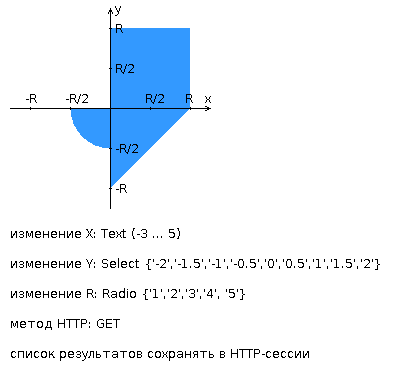

# Лабораторная работа #2
## Вариант: 6663128

Разработать веб-приложение на базе сервлетов и JSP, определяющее попадание точки на координатной плоскости в заданную область.

Приложение должно быть реализовано в соответствии с шаблоном MVC и состоять из следующих элементов:

- **ControllerServlet**, определяющий тип запроса, и, в зависимости от того, содержит ли запрос информацию о координатах точки и радиусе, делегирующий его обработку одному из перечисленных ниже компонентов. Все запросы внутри приложения должны передаваться этому сервлету (по методу GET или POST в зависимости от варианта задания), остальные сервлеты с веб-страниц напрямую вызываться не должны.
- **AreaCheckServlet**, осуществляющий проверку попадания точки в область на координатной плоскости и формирующий HTML-страницу с результатами проверки. Должен обрабатывать все запросы, содержащие сведения о координатах точки и радиусе области.
- **Страница JSP**, формирующая HTML-страницу с веб-формой. Должна обрабатывать все запросы, не содержащие сведений о координатах точки и радиусе области.

<d.parser input="string" ignoreCase="boolean">
    *any text*
</d.parser>

=>

`Input was found ${n} times`